## About

This is unofficial, untested, use at your risk, broken assembly instruction for building Dilemma v3 keyboard with Procyon mod.

You should check [Bastard Keyboards](https://bastardkb.com/) website for high quality, ready to use products.

## Dimensions

I'm using 3.0 mm thick acrylic plate.

In this scenario you should use 5.0 mm long M3 hex spacers.  
For top cover use 6.0 mm long M3 beveled head screws.

For 2.0 mm acrylic use 4.0 mm spacers and 5.0 mm top cover screws.  
For 1.0 mm acrylic use 3.0 mm spacers and 4.0 mm top cover screws (sanded down to 3.6 mm).

Bottom cover M3 flat head screws are always 3.0 mm.

Please note that for flat head screw you measure thread only.  
For beveled head ones you measure whole screw.

## Accessories

You need one USB-C to USB-C (or USB-A) cable for connecting keyboard with computer, tablet, phone.

You need one mini-jack audio cable for connecting two keyboard parts together.  
I'm using TRRS one (4 pins). TRS (3 pins) might work too according to KiCad diagram.

## Hardware Customization

Both left and right keyboard parts allows for swapping one key with rotary encoder.  
In this document encoder is on left side only.

It might be possible to place touchpad on left side.  
In that case some 3D parts should be flipped before printing.  
I've not tested this scenario so please consult KiCad diagrams and QMK firmware sources.

It is up to you regards picking keys you like the most. Same for key caps.

## Soldering

If you are lazy or do not have required skill it might be advised to order manufactured PCBs.  
In that scenario some additional soldering might be required regards to: RGB leds, audio sockets, rotary encoders, key sockets, buttons.  
Always compare with documentation and verify everything twice.

## Firmware

This document does not cover device flashing topic.  
You should go here: https://github.com/Bastardkb/qmk_userspace/releases

## Left side

### Parts

Screws

3D Prints

Acrylic Plate

PCB

Anti-slip Pads (10.0 x 3.0 mm)

### Steps

Six flat head screws, bottom 3D print, six spacers - combine.  
Align rotation of spacers.

Drop in acrylic plate.

Drop in middle layer 3D print.

Drop in PCB. Wiggle might be required.

Drop in top layer 3D print and cover with hole for logo.  
Use six beveled head screws to fix everything together.

Attach pads.

Insert keys, connect USB and flash firmware if needed.  
Is is alive!

## Right side

### Parts

Screws

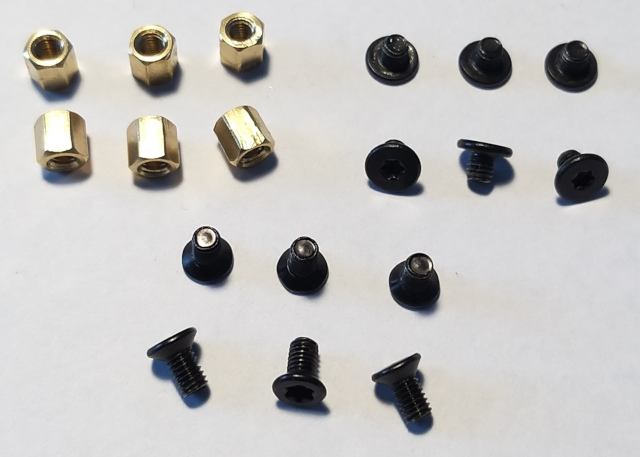

3D Prints

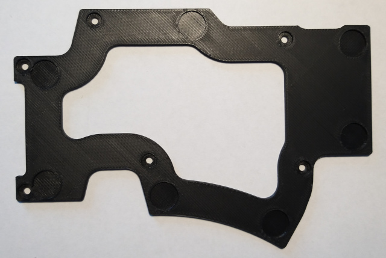

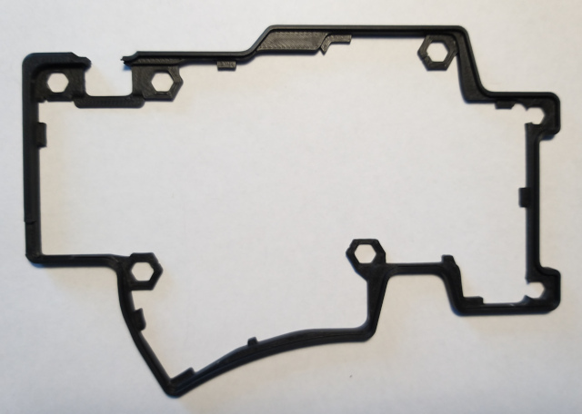

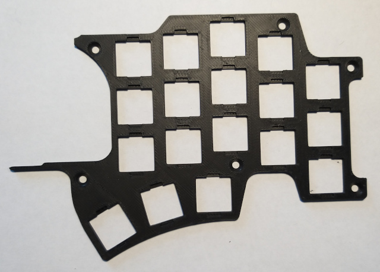

Touchpad  
Two 5.0 mm M3 inserts  
Two flat head 8.0 mm M3 screws  
100.0 mm FPC 12P 0.5 mm pitch type B

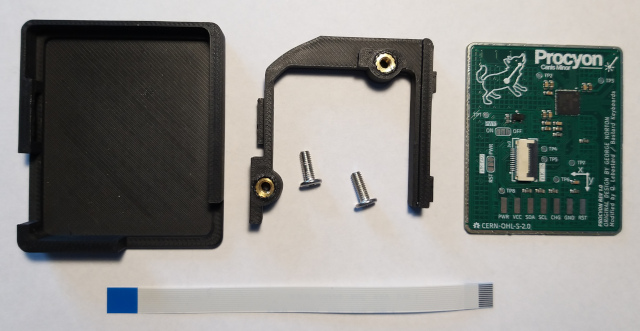

Acrylic Plate

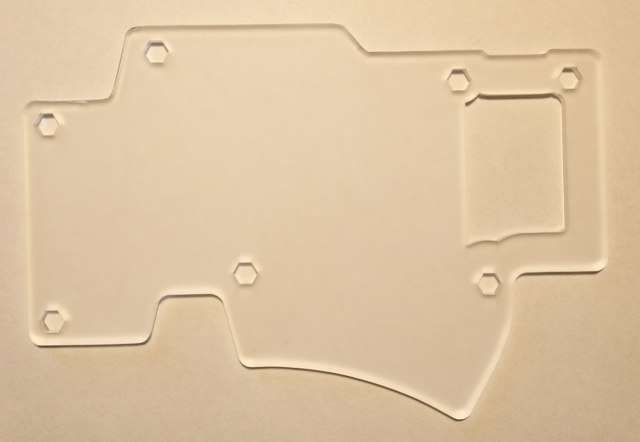

PCB

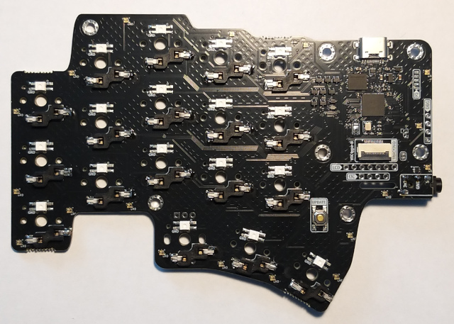

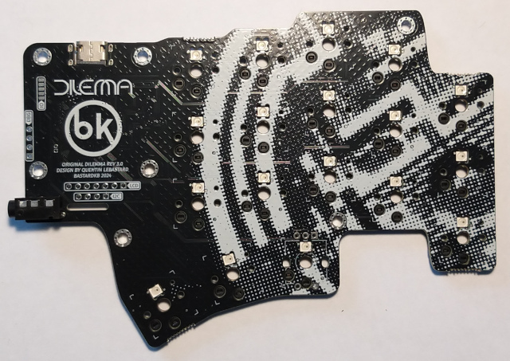

Anti-slip Pads (10.0 x 3.0 mm)

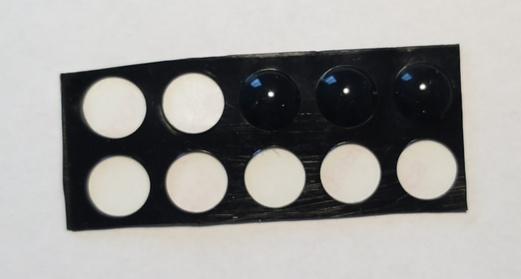

### Steps

Assemble touchpad.  
Put it aside.

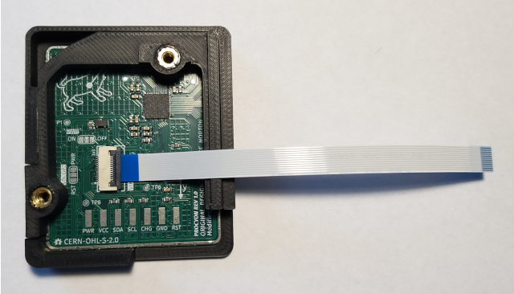

Two flat head screws, bottom 3D print, two spacers - combine.  
Align rotation of spacers.  
Put it aside.

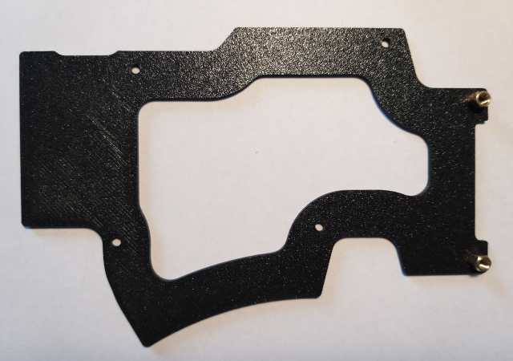

Four beveled head screws, top 3D print.

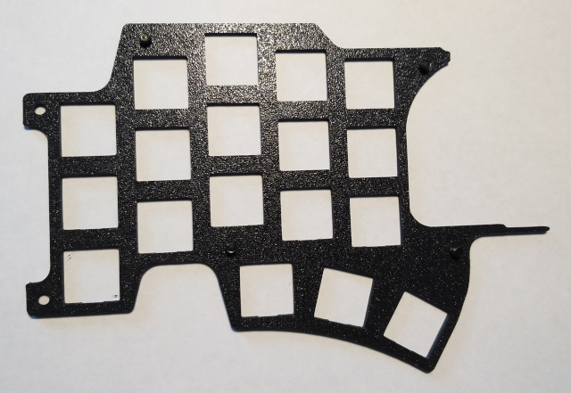

Drop in PCB. Fix using four spacers.  
Align rotation of spacers.

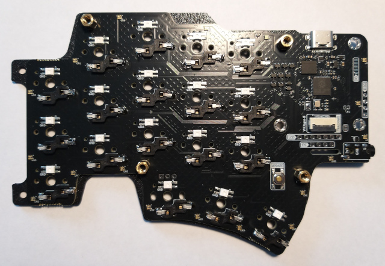

Connect touchpad.

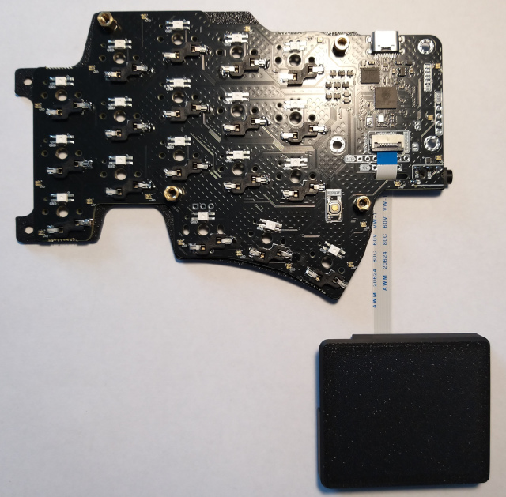

Align and flip touchpad.

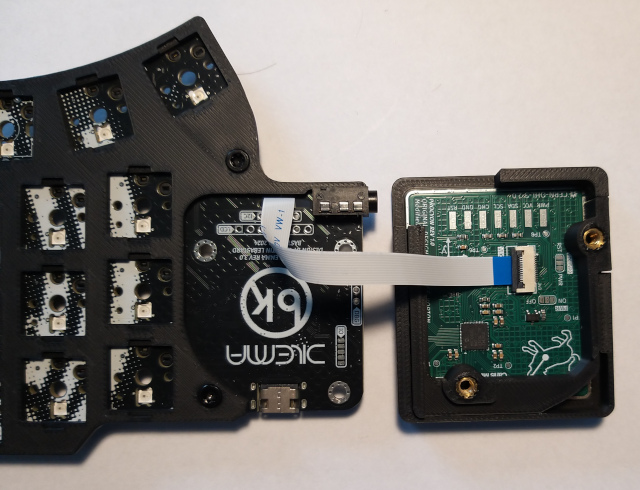

Secure touchpad using two 8.0 mm screws.

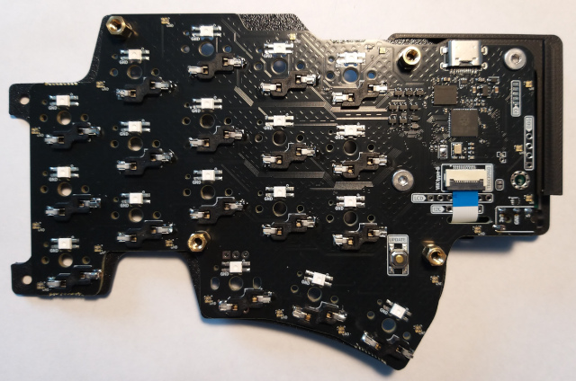

Drop in middle layer 3D print. Wiggle might be required.

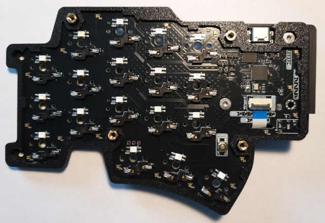

Drop in acrylic plate.

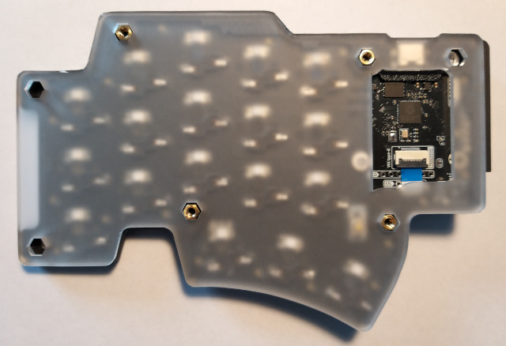

Drop in bottom layer 3D print. Use four flat head screws to fix it.  
Attach pads.

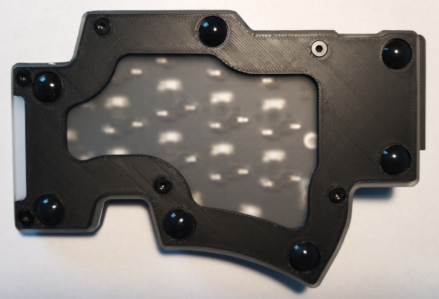

Use two remaining beveled head screws on right edge.  
Insert keys, connect USB and flash firmware if needed.  
Is is alive!

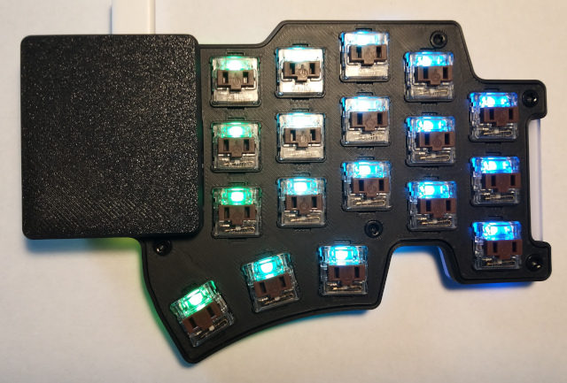

## Final

It is so beautiful.

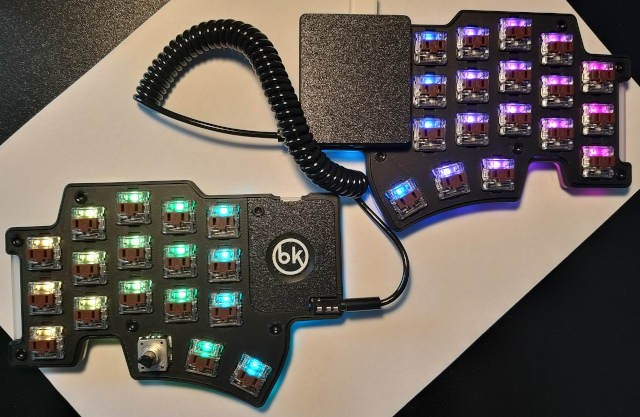
